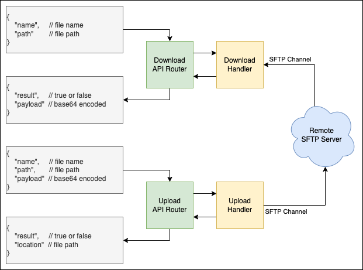

# Simple SFTP gateway service

This is a simple webflux API implementation of sftp upload and download binary files from SFTP Server.

Binary files that downloaded from/ uploaded to SFTP Server are handled as BASE64 encoded payload in WebLayer Request/Response json data.



### Upload Request

`POST` /upload
```json
{
    "name": "asdf.pdf", // filename + extension
    "path": "/user/downloads/sftp", // SFTP file path
    "payload": "Base64 encoded data"
}
```
`200`
```json
{
    "result": true, // boolean
    "location": "/user/downloads/sftp/asdf.pdf"
}
```
`error`
```json
{
    "error": "error status phrase",
    "message": "detail message"
}
```  
<br>

### Download Request

`POST` /upload
```json
{
    "name": "asdf.pdf", // filename + extension
    "path": "/user/downloads/sftp", // SFTP file path
}
```
`200`
```json
{
    "result": true, // boolean
    "payload": "Base64 encoded data"
}
```
`error`
```json
{
    "error": "error status phrase",
    "message": "detail message"
}
```

### dependencies

- Java 11
- spring-boot: 2.7.15
    - webflux
    - jdbc
    - data-jpa
- com.jcraft.jsch: 0.1.55
- h2
- lombok